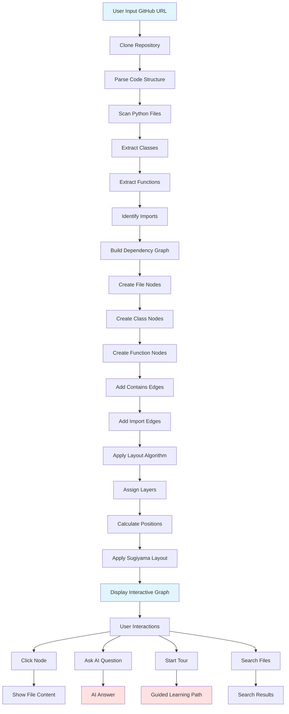
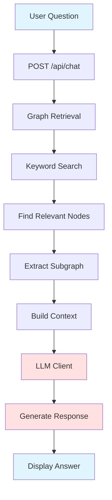

# CodeExplorer AI - Project Summary

## Overview
CodeExplorer AI là một công cụ khám phá repository codebase sử dụng graph visualization và AI-powered analysis. Ứng dụng giúp người dùng hiểu cấu trúc, mối quan hệ giữa các thành phần trong dự án thông qua giao diện trực quan và hỗ trợ AI.

## System Workflow



### Detailed Process Description

#### 1. Parse Code Structure (C)
- **Scan Python Files**: Tìm tất cả file `.py` trong repository
- **Extract Classes**: Sử dụng AST parser để tìm class definitions
- **Extract Functions**: Trích xuất function definitions (bao gồm methods)
- **Identify Imports**: Phân tích import statements để tìm dependencies

#### 2. Build Dependency Graph (D)
- **Create File Nodes**: Mỗi file thành một node với metadata (path, name)
- **Create Class Nodes**: Mỗi class thành node con của file
- **Create Function Nodes**: Mỗi function thành node con của class hoặc file
- **Add Contains Edges**: Edges từ file → class → function
- **Add Import Edges**: Edges giữa files khi có import relationships

#### 3. Apply Layout Algorithm (E)
- **Assign Layers**: Sử dụng longest path algorithm để gán layers cho nodes
- **Calculate Positions**: NetworkX multipartite layout tính toán (x, y) positions
- **Apply Sugiyama Layout**: Hierarchical layout cho DAGs với minimal edge crossings

## CodeFuse-CGM Integration

### Components Inherited from CodeFuse-CGM
Web application này được xây dựng dựa trên kiến trúc và concept từ dự án CodeFuse-CGM, với các thành phần sau:

#### 1. **Graph-Based Code Analysis Architecture**
- **Concept**: Sử dụng graph để biểu diễn cấu trúc code (nodes = files/classes/functions, edges = relationships)
- **Inheritance**: Web app áp dụng cùng kiến trúc graph-based analysis như CodeFuse-CGM
- **Implementation**: Tự implement simplified version cho web app

#### 2. **Code Graph Parser Integration**
- **Import**: `from retriever.codegraph_parser.python.codegraph_python_local import parse, NodeType, EdgeType`
- **Status**: Đã import nhưng hiện tại web app sử dụng custom AST parser (`_parse_python_file`)
- **Reason**: Custom parser cho performance và simplicity trong web context
- **Future**: Có thể tích hợp đầy đủ parser của CodeFuse-CGM cho accuracy cao hơn

#### 3. **Node and Edge Types**
- **Node Types**: File, Class, Function (tương tự CodeFuse-CGM)
- **Edge Types**: Contains, Imports, Calls (tương tự CodeFuse-CGM)
- **Implementation**: Web app sử dụng cùng taxonomy cho nodes và edges

#### 4. **Graph Layout Algorithm**
- **Sugiyama Layout**: Web app implement simplified Sugiyama layout
- **CodeFuse-CGM Reference**: CodeFuse-CGM có các layout algorithms khác (force-directed, circular)
- **Customization**: Web app chọn Sugiyama cho hierarchical visualization

#### 5. **Retrieval and Embedding Concepts**
- **Graph Retrieval**: Web app implement subgraph extraction tương tự CodeFuse-CGM
- **Embedding Index**: Có module `embedding_index.py` với concept từ CodeFuse-CGM
- **Implementation**: Custom implementation cho web app context
- **Current Status**: Sử dụng simplified hash-based embeddings (placeholder)
- **Production Plan**: Có thể tích hợp CodeFuse-CGE (CodeFuse Code Graph Embeddings) trong tương lai

### Embedding Implementation Details

**Current Implementation (Simplified):**
- **Method**: Hash-based deterministic embeddings
- **Dimension**: 768 (placeholder)
- **Generation**: Hash node string → seed random → generate embedding
- **Storage**: FAISS IndexFlatL2 for similarity search
- **Purpose**: Semantic search cho relevant nodes

**CodeFuse-CGM Concept:**
- CodeFuse-CGM có `preprocess_embedding/generate_code_embedding.py` cho code embeddings
- Sử dụng advanced embedding models (CodeFuse-CGE)
- Capture semantic meaning của code structure

**Why Simplified:**
- Web app focus trên visualization, không cần advanced embeddings
- Performance considerations cho real-time web context
- LLM có thể hiểu context từ graph structure mà không cần embeddings

**Future Enhancement:**
- Tích hợp CodeFuse-CGE cho better semantic understanding
- Sử dụng pre-trained code embedding models
- Improve retrieval accuracy cho complex queries

### Current Implementation Status
- **Partial Integration**: Web app kế thừa kiến trúc và concept nhưng tự implement nhiều components
- **Simplified Version**: Để phù hợp với web context và real-time interaction
- **Extensible**: Architecture cho phép tích hợp sâu hơn với CodeFuse-CGM trong tương lai

### Differences from CodeFuse-CGM
- **CodeFuse-CGM**: Focused on code generation, rewriting, and complex retrieval
- **Web App**: Focused on visualization, exploration, and beginner-friendly onboarding
- **Scope**: Web app subset của CodeFuse-CGM với UI/UX focus

## AI Query Mechanism



### Query Processing Steps

#### 1. User Question Input
- User nhập câu hỏi về codebase vào chat interface
- Question được gửi qua API endpoint `/api/chat`
- Payload bao gồm: question, job_id, conversation_history

#### 2. Graph Retrieval
- **Keyword Search**: Extract keywords từ question
- **Node Matching**: Tìm nodes có label/name/path match với keywords
- **Subgraph Extraction**: Extract subgraph quanh relevant nodes (k-hop neighbors)
- **Context Building**: Build context string từ subgraph structure

#### 3. LLM Processing
- **Prompt Construction**: Combine question + graph context + conversation history
- **LLM Call**: Gửi prompt đến OpenAI API (hoặc custom LLM endpoint)
- **Response Generation**: LLM generate answer dựa trên context
- **Post-processing**: Format response cho display

#### 4. Response Display
- Hiển thị answer trong chat interface
- Lưu vào conversation history cho follow-up questions
- Cung dụng citations/references đến relevant nodes

### Context Building Strategy

**Graph Context Includes:**
- Node metadata (file path, class/function names)
- Edge relationships (contains, imports, calls)
- Code snippets từ relevant files
- Structural information (hierarchy, dependencies)

**Prompt Template:**
```
Question: {user_question}

Repository Context:
- Repository: {repo_name}
- Relevant Files: {file_paths}
- Classes: {class_names}
- Functions: {function_names}

Graph Structure:
{subgraph_representation}

Conversation History:
{history}

Please answer the question based on the repository structure and code context.
```

### Example Query Flow

**User Question:** "How does the authentication work in this project?"

**Processing:**
1. Extract keywords: "authentication"
2. Search nodes with "auth" in name/path
3. Find files: `auth.py`, `login.py`, `middleware.py`
4. Extract subgraph: auth-related classes/functions
5. Build context: file paths, class definitions, function signatures
6. LLM generates answer explaining authentication flow

**Response:** "The authentication system uses JWT tokens stored in `auth.py`. The `login()` function validates credentials and generates tokens, while the middleware in `middleware.py` protects routes..."

## Tech Stack

### Backend
- **Framework**: FastAPI
- **Language**: Python 3.8+
- **Graph Processing**: NetworkX
- **LLM Integration**: OpenAI GPT (configurable)
- **Code Analysis**: CodeFuse-CGM components
- **Dependencies**:
  - fastapi, uvicorn
  - networkx
  - openai
  - python-multipart
  - gitpython

### Frontend
- **Framework**: React 18
- **Graph Visualization**: React Flow
- **Styling**: TailwindCSS
- **Icons**: Lucide React
- **HTTP Client**: Axios
- **Build Tool**: Vite

## Architecture

### Backend Architecture
```
backend/
├── main.py                 # FastAPI application & API endpoints
├── graph_builder.py        # Code analysis & graph construction
├── graph_layout.py         # Graph layout algorithms (Sugiyama)
├── graph_retriever.py      # Graph-based retrieval for AI
├── llm_client.py           # LLM integration layer
└── embedding_index.py      # Vector embeddings for semantic search
```

### Frontend Architecture
```
frontend/
├── src/
│   ├── App.jsx             # Main application component
│   ├── components/
│   │   ├── RepoInput.jsx           # GitHub repository input
│   │   ├── GraphVisualization.jsx  # Interactive graph display
│   │   ├── ChatBox.jsx             # AI chat interface
│   │   ├── RepoOverview.jsx        # Repository statistics dashboard
│   │   ├── ProjectTree.jsx         # Project structure tree view
│   │   ├── InteractiveTour.jsx     # AI-powered guided tour
│   │   └── FileSearch.jsx          # File search functionality
```

## Features Implemented

### 1. Repository Analysis & Graph Construction
- Clone GitHub repositories
- Parse code structure (files, classes, functions)
- Build dependency graph
- Identify relationships between components
- Calculate complexity metrics

### 2. Interactive Graph Visualization
- **Sugiyama Layout**: Hierarchical layered layout for clear visualization
- **Full-screen Graph**: Immersive visualization experience
- **Node Interaction**: Click to view details, file content, and AI explanation
- **Branch Highlighting**: Highlight connected nodes when dragging
- **Mini Map**: Navigation and overview of large graphs
- **Zoom & Pan**: Smooth navigation controls

### 3. AI-Powered Features

#### 3.1 AI Chat with Graph Retrieval
- Ask questions about the codebase
- Graph-aware retrieval for accurate answers
- Context-aware responses using embeddings
- Follow-up questions support

#### 3.2 AI Explanation for Code
- Automatic code explanation for selected nodes
- Understanding code functionality
- Best practices and suggestions

#### 3.3 AI-Powered Interactive Tour
- **Repository Summary**: First step provides comprehensive overview
  - What the repository does (Purpose/Mission)
  - Main features and functionalities
  - How it works (Architecture/Flow)
- **Personalized Learning Path**: AI-generated step-by-step guide
  - Identifies entry points and important modules
  - Suggests files to examine at each step
  - Tailored to repository structure
- **Clickable File Recommendations**: Click files in tour to highlight in graph

### 4. Repository Overview Dashboard
- **Statistics Cards**:
  - Total files
  - Total classes
  - Total functions
  - Lines of code
  - Complexity score
  - Last updated timestamp
- **Language Distribution**: Programming languages used
- **Quick Stats**: High-level metrics

### 5. Project Structure Tree View
- Hierarchical file/folder tree
- Expand/collapse folders
- Click files to view content
- Visual representation of project structure

### 6. File Search
- **Real-time Search**: Instant results as you type
- **Type Filters**: Filter by file, class, or function
- **Path Matching**: Search in labels, names, and paths
- **Click-to-View**: Click results to highlight in graph

### 7. Resizable & Movable Panels
- **File Content Panel**: View selected file content
- **AI Explanation Panel**: Display AI-generated explanations
- **Drag to Move**: Reposition panels anywhere
- **Resize**: Adjust panel dimensions
- **Chat Integration**: Follow-up questions within AI panel

## API Endpoints

### Repository Processing
- `POST /api/process-repo` - Start repository analysis
- `GET /api/job-status/{job_id}` - Check processing status

### Graph Data
- `GET /api/graph/{job_id}` - Get graph nodes and edges
- `GET /api/node/{job_id}/{node_id}` - Get node details with connected nodes

### Repository Information
- `GET /api/repo-overview/{job_id}` - Get repository statistics
- `GET /api/project-structure/{job_id}` - Get project tree structure
- `GET /api/repo-summary/{job_id}` - Get AI-generated repository summary

### AI Features
- `POST /api/explain-node` - Get AI explanation for a node
- `POST /api/chat` - Chat with the repository using AI
- `POST /api/generate-learning-path/{job_id}` - Generate personalized learning path

### Search
- `POST /api/search-files/{job_id}` - Search files, classes, functions

## Key Technical Highlights

### 1. Graph Layout Algorithm
- **Sugiyama Layout**: Hierarchical layered layout for DAGs
- **Layer Assignment**: Longest path layering
- **Position Calculation**: NetworkX multipartite layout
- **Scaling**: Automatic scaling to fit viewport

### 2. LLM Integration
- **Configurable Model**: Support for OpenAI GPT models
- **Context Building**: Dynamic context from graph structure
- **Prompt Engineering**: Optimized prompts for different tasks
- **Error Handling**: Fallback mechanisms for API failures

### 3. Graph Retrieval
- **Subgraph Extraction**: Extract relevant context around nodes
- **Path-based Retrieval**: Find related nodes through graph paths
- **Embedding Index**: Semantic search for code understanding

### 4. React Flow Integration
- **Custom Node Styles**: Different styles for files, classes, functions
- **Edge Types**: Different edge styles for different relationship types
- **Interactive Controls**: Zoom, pan, mini map
- **Event Handling**: Click, drag, selection events

### 5. State Management
- **React Hooks**: useState, useEffect, useCallback
- **Component Communication**: Props drilling for data flow
- **Loading States**: Visual feedback during async operations
- **Error Handling**: Graceful error messages and fallbacks

## User Experience

### Onboarding Flow
1. User enters GitHub repository URL
2. System clones and analyzes repository
3. Graph visualization loads with full-screen view
4. Repo Overview Dashboard shows automatically
5. User can:
   - Explore graph interactively
   - Use AI chat for questions
   - Follow AI-powered tour
   - Search for specific files
   - View project structure

### Interactive Tour Flow
1. Click "Start AI-Powered Tour"
2. First step: Repository Overview (AI-generated summary)
3. Subsequent steps: Personalized learning path
4. Each step suggests files to examine
5. Click files to highlight in graph and view content
6. Navigate through steps with Next/Previous

### File Exploration Flow
1. Click node in graph or search result
2. File content panel opens
3. AI explanation panel opens
4. Ask follow-up questions in chat
5. Drag/resize panels as needed

## Performance Considerations

### Backend
- **Async Processing**: Non-blocking repository analysis
- **Job Queue**: Multiple concurrent jobs supported
- **Caching**: Graph data cached after processing
- **Error Recovery**: Retry mechanisms for external APIs

### Frontend
- **Lazy Loading**: Components load on demand
- **Virtual Scrolling**: For large lists (tree view)
- **Debounced Search**: Reduce API calls during search
- **Optimized Renders**: useCallback, useMemo for performance

## Security Considerations

- **API Key Management**: Environment variables for LLM API keys
- **Input Validation**: Validate GitHub URLs and user inputs
- **Error Messages**: Generic error messages to avoid information leakage
- **File Access**: Controlled access to cloned repositories

## Future Enhancements

### Potential Improvements
1. **Advanced Graph Layouts**: Force-directed, circular layouts
2. **Code Diff Visualization**: Compare different versions
3. **Collaboration Features**: Share analysis with team
4. **Export Options**: Export graph as image or data
5. **More LLM Models**: Support for local LLMs
6. **Real-time Updates**: Watch for repository changes
7. **Custom Themes**: Dark/light mode, color schemes
8. **Keyboard Shortcuts**: Power user navigation

## Deployment

### Environment Setup
```bash
# Backend
cd backend
pip install -r requirements.txt
uvicorn main:app --reload

# Frontend
cd frontend
npm install
npm run dev
```

### Configuration
- Set `OPENAI_API_KEY` in environment
- Configure `OPENAI_MODEL` (default: gpt-3.5-turbo)
- Set `OPENAI_API_BASE_URL` if using custom endpoint

## Conclusion

CodeExplorer AI là một công cụ mạnh mẽ giúp developer hiểu codebase nhanh hơn thông qua:
- **Visual Exploration**: Graph visualization cho cấu trúc code
- **AI Assistance**: LLM-powered explanations và answers
- **Guided Learning**: Personalized tour cho beginners
- **Efficient Search**: Quick file/function lookup

Ứng dụng kết hợp graph analysis, AI, và modern UI để tạo trải nghiệm khám phá code hiệu quả và intuitive.
